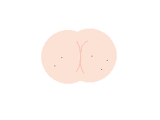

<p align="center">
  
</p>

<div align="center">
 <strong>(F)</strong>art <strong>(S)</strong>melling <strong>(M)</strong>achine
 <br />
 Lol just kidding, <em>but can you imagine?</em>
</div>

# fsm

Yet another finite state machine library for Clojure(Script).

[](https://cljdoc.org/d/com.github.brianium/fsm/CURRENT) [](https://clojars.org/com.github.brianium/fsm)

## Table of contents

- [Using fsm](#using-fsm)
  - [create-state-machine](#create-state-machine)
  - [transition](#transition)
  - [add-effect](#add-effect)
  - [StateMachine](#statemachine)
- [Demo](https://brianium.github.io/fsm/)

### Using fsm

It only supports hash maps. It works in the browser and the jvm. You make a state machine. You transition it
to new states via events. You can register side effects. It is a great time!

#### create-state-machine

Here is how you describe states:

```clojure
(def states {nil       {::init ::ready}
             ::ready   {::enable ::enabled}
             ::enabled {::disable ::disabled
                        ::stop    nil}
             ::disabled {::enable ::enabled
                         ::cancel nil}})
```

Every key is a named state. A `nil` state can mean pre-existence. Or non-existence. Or "not yet a thing"-ness. 

You can use this state description to make a new state machine:

```clojure
(require '[fsm.core :as fsm])

(def initial-state {})

(def state-machine (fsm/create-state-machine states initial-state))
```

Your state map will automatically have an `:fsm/state` key added with the named state - i.e `::ready`, `::enabled`, etc. It will also contain an `:fsm/last-event` key containing the last event.

A third argument can be provided which is an `atom-fn` that is used. Defaults to `atom`

```clojure
(require '[reagent.core :as r])

(def state-machine (fsm/create-state-machine states initial-state r/atom))
```

#### transition

You move a state machine from one state to the next via the `transition` function. `transition` is effectively a no-op if you try to do an invalid transition i.e you can't `::disable` an already `::disabled` state machine.

The final argument is the new state of the state machine. It is all or nothing here. No partial updates, just give me the new state. A function CAN be used if you want to modify existing state. If the last argument is omitted entirely, a `nil` payload is assumed.

```clojure
(fsm/transition state-machine ::init {:count 0})

;;; You can use a function of arity 1 that returns a new state, or in this case the current state

(fsm/transition state-machine ::enable fsm/current-state)

;;; Or omit it to set the underlying data structure to nil

(fsm/transition state-machine ::stop)
```

#### add-effect

Allows you to do things in response to state changes. All effects must be named by a keyword. Side effects can be called in a few ways:

```clojure
;;; Do something whenever state changes
(fsm/add-effect state-machine ::log (fn [sm old-state new-state] (println new-state)))

;;; Do something when moving from one explicit state to another, in this case from ready to enabled
(fsm/add-effect state-machine ::start ::ready ::enabled on-enabled)

;;; Do something when the state machine moves from one of the given set to an explicit state, in this case
;;; when the state machine reaches a nil state from the ready OR enabled state
(fsm/add-effect state-machine ::shutdown #{::ready ::enabled} nil on-shutdown)
```

#### StateMachine

The default implementation for this library is backed by atoms. A custom implementation can be supported by
implementing the `StateMachine` protocol. The atom backed one may serve as a good example:

```clojure
(ns fsm.impl
  (:require [fsm.protocols :as p]))

(defrecord AtomStateMachine [states *state]
  p/StateMachine
  (-transition [_ event payload]
    (let [current @*state
          next    (get-in states [(:fsm/state current) event] ::not-found)]
      (when-not (= ::not-found next)
        (->> payload
             (merge {:fsm/state next})
             (reset! *state)))))

  (-add-effect [this key fn-3]
    (add-watch *state key (fn [_ _ old new]
                            (fn-3 this old new))))

  (-current-state [_]
    @*state))
```
